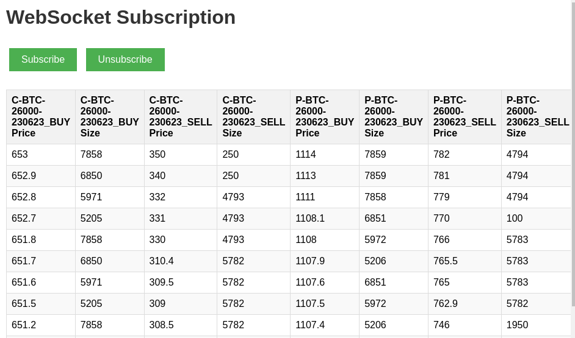

# Delta Exchange Order Book WebSocket Client

This is an asynchronous WebSocket client that connects to the Delta exchange and subscribes to order book channels for specific products. It processes incoming order book messages, updates the order book data, and saves the buy and sell order book data as CSV files.

## Prerequisites

- Python 3.7 or higher
- `websockets` library (`pip install websockets`)
- `pandas` library (`pip install pandas`)

## Usage

1. Setup env: `cp .env.example .env`
2. Update the `WEBSOCKET_URL` parameter with the WebSocket URL for the Delta exchange. 
3. Define the products to subscribe to in the `PRODUCTS` parameter. 
4. Install dependencies: `pip3 install -r requirements.txt`
5. Run the script `python3 app.py`. 
6. Click url link on console -> show a basic UI. 
7. Click **Subscribe** button to start tracking the order books. 
8. Click **Unsubscribe** button to test what happen when the websocket connection drop. The UI bellow:

The script will establish a connection to the Delta exchange WebSocket server and start subscribing to the order book channels for the specified products. It will continuously listen for incoming messages and update the order book data accordingly. The buy and sell order book data will be saved as separate CSV files in the `./data/` directory.

## Configuration

You can modify the script to suit your needs:

- Update the WebSocket URL to connect to a different exchange or server.
- Modify the list of products to subscribe to.
- Customize the output directory for saving the order book CSV files.

## License

This code is licensed under the [MIT License](LICENSE).
